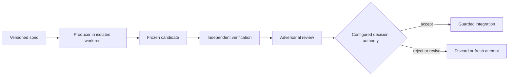

<p align="center">
  <a href="https://github.com/PyModel/claude-architect"></a>
</p>

<p align="center">
  <a href="#quick-start"></a>
  <a href="#direct-codex-cli"></a>
  
  
  
</p>

**Verified coding-agent delegation for Claude Code.** Claude stays the architect and reviewer: it writes the spec, judges the evidence, and reports what landed. Implementation goes to a fresh-context implementer on the coding CLI you choose (**Codex, OpenCode, Pi, Pythinker, Antigravity CLI, or a headless Claude Code session**), each invocation starting clean inside an isolated Git worktree. The work comes back as a frozen, hash-anchored candidate that Claude reviews against independent verification evidence before a single byte can reach your checkout.

Three guarantees are enforced in host code, not in prompts:

- **Isolation.** Every Producer runs in a detached worktree with a sanitized environment, an explicit write allowlist, and OS sandboxing where certified. Out-of-scope changes are rejected at freeze time.
- **Evidence over claims.** A Producer saying "tests pass" is never accepted; the runtime reruns your authorized verification commands in a clean worktree and records the real output.
- **Separated authority.** Implementers cannot approve their own work. Review, decision, and hash-gated integration are separate steps, and integration stages the reviewed tree without committing it. Only a reviewed candidate carrying commit-bound gate clearance is accepted without prompting; anything less requires a human ([decision authority](#decision-authority)).

> **Public beta.** Do not use Claude Architect unattended for production, destructive, or security-sensitive work. Review the complete candidate and verification evidence before integration. Producer availability depends on host OS, CLI version, authentication, requested lane, and proven execution capabilities.

## Core workflow



All agent output is an untrusted candidate. A candidate that fails independent verification, or whose review gate refused it, can only be accepted by a human.

## Installation

Claude Code requires Node.js 22 or newer.

```bash
claude plugin marketplace add PyModel/claude-architect
claude plugin install claude-architect@claude-architect
claude plugin list --json
```

Restart Claude Code after installing or updating. Install and authenticate at least one supported Producer CLI (`codex`, `opencode`, `pi`, `pythinker`, `agy`, or `claude`); Claude Architect reports unavailable lanes rather than silently substituting another agent.

## Quick start

Open Claude Code in a Git repository and name the Producer you want:

```text
/claude-architect:delegate Use Codex to add rate limiting to the public API, run the tests, and show me the independently reviewed candidate before integration.
```

If no Producer is named, the skill asks you to choose one. Model selection inside a lane is optional and defers to that CLI's configured default:

| Lane | Overrides |
|---|---|
| OpenCode, Antigravity CLI | model, thinking / variant / effort |
| Pythinker | provider and model; no reasoning override |
| Claude Code | model (Opus or Sonnet), reasoning effort |
| Codex | model, reasoning effort |
| Pi | thinking level only; a model override fails the lane instead of substituting one |

Non-trivial work runs through the fresh-context review pipeline. Read the exact patch, findings, and verification output before deciding whether to accept.

### Direct Codex CLI

The direct, unverified Codex CLI lane runs `codex exec` against your current checkout without an isolated worktree, frozen Candidate Artifact, or independent verification:

```text
/claude-architect:codex Review this checkout with gpt-5.6-sol at high reasoning.
```

Use it for direct Codex assistance when those controls are not required. Use `/claude-architect:delegate` when changes need the verified lane and its isolated worktree, frozen Candidate Artifact, independent verification, and guarded integration.

### Superpowers inside an attempt

Producers do not inherit host-side Superpowers skills. Each edit attempt is offered only three task-scoped procedures compatible with the trust model: `test-driven-development`, `systematic-debugging`, and `verification-before-completion`, vendored from [obra/superpowers](https://github.com/obra/superpowers) 6.2.0 under MIT. Skills that assume nested delegation, self-review, branch acceptance, or an interactive human stay with the architect, the configured decision authority, and the human.

### Lanes as native subagents

Dispatch a delegation through the `delegation-lane` agent to watch it as a native Claude Code subagent row instead of a long-running MCP call. The lane agent is a courier whose only tools are `delegate` and `delegatePipeline`; it cannot read the repository, run commands, review, decide, or integrate. Lanes against different repositories run in parallel; lanes against the same repository are serialized by the runtime's repository lock. All reviewable evidence comes from `reviewCandidate`, and every acceptance is gated on independent verification with its provenance recorded. Details live in the delegate skill.

## Decision authority

By default, `decideCandidate` records `accepted` without prompting for an independently verified candidate that produces no advisory warnings from a readable archive: either a `delegatePipeline` candidate carrying a durable `pipelineGateCleared` record that names the archived candidate commit and does not require a human, or a plain `delegate` result judged on its independent verification alone. Gate-refused, review-incomplete, malformed, commit-mismatched, human-required, unverified, or unreadable cases still require a human, as does every non-accept verdict. Set `CLAUDE_ARCHITECT_DECISION_AUTHORITY=human` to require confirmation for every decision; an unrecognized value fails closed to `human` with a warning.

This never relaxes the gates themselves: independent verification decides what may be accepted at all, integration refuses any acceptance whose provenance is unknown, and it aborts on a moved `HEAD`, a dirty tree, or a hash that does not match the reviewed artifact. Every decision records its provenance.

## Skills, agents, and MCP tools

| Kind | Name | Purpose |
|---|---|---|
| Skill | `/claude-architect:delegate` | Builds a versioned spec and drives delegation, review, decision, and guarded integration. |
| Skill | `/claude-architect:codex` | Runs Codex CLI directly against the current checkout without the verified delegation lifecycle. |
| Skill | `/claude-architect:subagent-driven-delegation` | Executes a multi-task plan with the Superpowers subagent-driven-development loop, using a verified Producer as the implementer for every task. |
| Agent | `advisor` | Strictly read-only commitment-boundary advisor. |
| Agent | `candidate-reviewer` | Read-only Opus reviewer for one frozen candidate: reads the exact bytes through `reviewCandidate`, returns two verdicts and a recommendation, never decides or integrates. |
| Agent | `delegation-lane` | Courier that dispatches one delegation as a native subagent row. |
| MCP | `validateDelegationSpec` | Validates a spec without starting a Producer and returns its canonical correlation digest. |
| MCP | `delegate` | Runs one validated, isolated, independently verified attempt. |
| MCP | `delegatePipeline` | Runs the fresh-context implement / review / repair pipeline. |
| MCP | `reviewCandidate` | Returns the exact frozen patch and verification evidence. |
| MCP | `decideCandidate` | Records accepted, rejected, or revision-requested. |
| MCP | `integrateCandidate` | Applies an accepted hash-matched candidate under safety guards. |
| MCP | `doctor` | Reports runtime, Git, platform, and Producer diagnostics. |
| MCP | `gitStatus`, `gitDiff`, `gitLog`, `gitChangedFiles` | Bounded, redacted, read-only Git evidence for advisors. |

## Security and trust model

Authority is separated across roles and artifacts. Producers receive bounded write scope in isolated worktrees. Candidate bytes are frozen and identified by hashes before independent verification. Reviewers operate in fresh context, and read-only roles lack mutation tools. The runtime rejects nested delegation, scope escapes, changed bases, mismatched anchors or trees, and unaccepted candidates. Integration stages reviewed bytes; it does not commit them.

The central rule: **all agent output is an untrusted candidate; implementers cannot approve their own work; and only an independently verified pipeline candidate with commit-bound gate clearance can be accepted without a human.** Verification reduces risk but does not establish that a change is safe for your particular deployment. See [docs/SECURITY_MODEL.md](docs/SECURITY_MODEL.md), [docs/THREAT_MODEL.md](docs/THREAT_MODEL.md), and [docs/TRUST_BOUNDARIES.md](docs/TRUST_BOUNDARIES.md).

## Permissions and external commands

The plugin starts its MCP server with `${CLAUDE_PLUGIN_ROOT}/runtime/bootstrap.mjs`. It may invoke Git, Node.js, configured verification executables, and a selected Producer CLI. Producer processes can edit only through an eligible isolated lane; verification commands are Host-authorized and their confinement and network enforcement is reported honestly. The runtime uses executable-plus-argv invocation, sanitized environments, bounded timeouts, process-tree termination, executable policy, and path validation. Never authorize secrets, deployment commands, destructive commands, or broader write globs than the task requires.

Codex edit confinement uses `codex-native-sandbox`: native macOS arm64 is certified, Linux is tested where unprivileged user namespaces permit the native sandbox, and native Windows editing is unsupported. Unsupported or failed confinement is diagnostics-only and fails closed. The Codex adapter enforces `--disable multi_agent` together with `features.multi_agent_v2={enabled=false,max_concurrent_threads_per_session=1}`. Installed marketplace copies must update and reload Claude Code before a new runtime or adapter controls take effect.

## Data storage and privacy

Durable run state, manifests, frozen artifacts, decisions, and recovery metadata live beneath the Claude Code-provided `${CLAUDE_PLUGIN_DATA}` directory. Temporary isolated worktrees and process files use OS temporary storage and are recovered or pruned by the runtime. Production runs do not fall back to an implicit state directory when `${CLAUDE_PLUGIN_DATA}` is unavailable.

Logs and MCP evidence are bounded and redacted; prompt and argument values are not intentionally logged. Producer CLIs and configured model providers have their own telemetry, retention, and privacy policies. Do not place credentials or sensitive data in delegation specs, prompts, test fixtures, or command arguments. See [docs/PRIVACY.md](docs/PRIVACY.md).

## Limitations and non-goals

- Public beta, not an autonomous merge or deployment system. It does not prove business correctness, eliminate supply-chain risk, or replace human security review.
- Native Codex edit confinement is certified on macOS arm64; other platform and Producer combinations may be tested, diagnostics-only, or unavailable.
- Managed worktrees need filesystems with stable birth timestamps and same-directory hard links; other mounts are diagnostics-only. Cleanup guarantees, Windows helpers, and the `CLAUDE_ARCHITECT_EMPTY_DIRECTORY_TIMEOUT_MS` override are documented in [docs/operations.md](docs/operations.md).
- An unavailable requested Producer is reported and fails closed; the runtime never substitutes another Producer or bypasses a denied edit lane.
- Verification commands are evidence, not automatically sandboxed build infrastructure.
- Integration stages an accepted candidate but never commits, pushes, opens a pull request, or deploys it.

## Development

```bash
npm install
npx tsc --noEmit
npx vitest run
bash scripts/validate-release.sh
claude plugin validate .
```

Enable the local push gate once per clone with `git config core.hooksPath .githooks`. [AGENTS.md](AGENTS.md) holds the architecture boundaries, trust invariants, testing requirements, packaging rules, and the minor-version-only release policy. Contributions are welcome: keep changes narrowly scoped, add tests that prove the relevant trust property, run all repository checks, and explain platform or security implications.

## Support and license

Use [GitHub Issues](https://github.com/PyModel/claude-architect/issues) for reproducible bugs and questions, including the plugin version, host OS and architecture, Claude Code version, Producer CLI and version, redacted diagnostics, and reproduction steps. Report suspected vulnerabilities through the repository's [private security advisory form](https://github.com/PyModel/claude-architect/security/advisories/new), never a public issue.

Claude Architect is licensed under the [MIT License](LICENSE).
